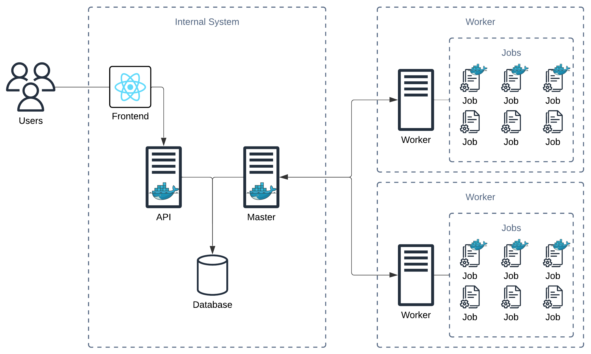

# Distributed Job Runner

This project is a graduation thesis for the Software Engineering and Information Technology bachelor with honors study program on the [Faculty of Technical Sciences](http://ftn.uns.ac.rs/691618389/fakultet-tehnickih-nauka) Novi Sad.

System for a distributed Job Runners consists of two parts, Centralized Platform, and Distributed Workers.

## Architecture overview



### Central Platform

This is a system for managing Jobs, Workers, and Credentials. Internally, it is made from the following services:
1. Frontend
2. API
3. Master

#### Frontend
A web application where users can interact with the system, get an overview of workers, create and manage Jobs, get insights into specific Jobs outputs.
It is a publicly available [ReactJS](https://react.dev/) application.

#### API
This is a service which is consumed by the Frontend app. It is in charge of storing all jobs information and making it available for users.
It is publicly available [FastAPI](https://fastapi.tiangolo.com/) application.

#### Master
Service in charge of the communication with all worker nodes of all clients.
It is a Python application, publicly available through the WebSocket protocol ([SocketIO](https://socket.io/) implementation).

### Worker
Worker is node running Jobs. Workers are used for distributing multiple workloads to multiple nodes.
It is a Python application that fetches the Job information from the Master, executes it, and sends all Job execution details back to the Master in near real-time.

## Local Setup
### Prerequisites:
Docker must be installed and started on the host machine.

### Run Central Platform
```shell
; cp .env.master.example .env.master
# edit .env.master.docker
; docker compose -f docker-compose-master.yaml up -d
```
This will run all necessary services (api, frontend, and master).

Frontend will be available on the http://localhost:3000 \
API will be available on the http://localhost:8000 \
Master will be available on the http://localhost:8080

### Run Worker
There are two options for running Workers:
1. On a host machine
2. In a Docker container

Running them in the Docker container is more convenient and easier to set up, however it sets a limitations in a way that Job can be ran. When running the Worker in a Docker container it is not possible to run Jobs on a host machine, making it less suitable for Job requiring access to the specific hardware of the host.

#### Worker in Docker container
```shell
; cp .env.worker.example .env.worker.docker
# edit .env.worker.docker
; docker compose -f docker-compose-worker.yaml up -d
```
This will run Worker, which will connect to the Master node if it is available.

#### Worker on Host machine
> This was tested on a Python 3.11.4, running on Apple Silicon M1 Chip.

```shell
; cd src/worker
; python3 -m venv .venv
; source .venv/bin/activate
; pip install -r requirements.txt
; MASTER_URL=<url of master instance> API_KEY=<your api key> python server.py
```
